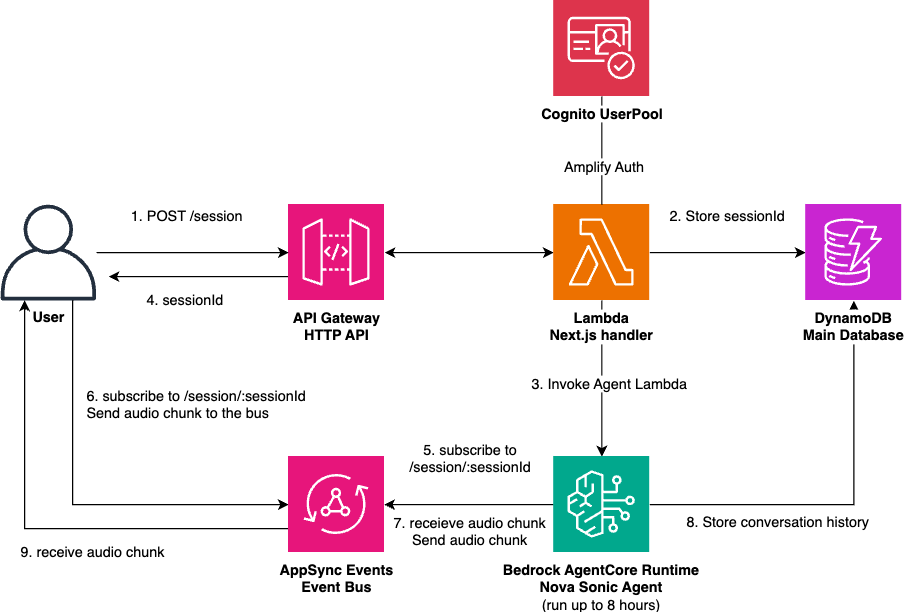

# Serverless Nova Sonic Chat App

This is a sample implementation for deploying a Nova Sonic application using serverless AWS services.



## Key Features

- Implementation of serverless real-time communication between server and client using AppSync Events
- Reference to past conversation history
- ToolUse implementation
- MCP (Model Context Protocol) support - Connect to various external services and tools via MCP servers
- Automatic resume for conversations exceeding 8 minutes (current Nova Sonic limit)
- Chat UI implementation using Next.js + shadcn

## Deployment Instructions

### 1. Prerequisites

First, prepare an environment capable of running AWS CDK. This environment must meet the following conditions:

* Required software installed:
  * [Node.js](https://nodejs.org/en/download/)
    * v20 or higher recommended
    * Check with `node -v` command
  * [AWS CLI v2](https://docs.aws.amazon.com/cli/latest/userguide/getting-started-install.html)
    * Check with `aws --version` command
  * Docker
    * Check with `docker --version` command
* AWS CLI configured with appropriate AWS IAM permissions (Administrator equivalent required)
  * Set up IAM role or enter IAM user information with `aws configure` command
* Internet connection with ability to communicate with AWS APIs
  * May not work properly in closed network environments

Any environment that meets the above requirements can be used, including local terminals or EC2 instances. Once you've confirmed these conditions, proceed to the next step.

### 2. Deployment Parameter Configuration

You can configure deployment parameters by editing [cdk.ts](cdk/bin/cdk.ts).

Configurable parameters include:

* Deployment region (default: inherits IAM session)
* Nova Sonic model region (default: us-east-1)
* Email domains allowed to sign up to Cognito (default: all allowed)

See the file for details.

### 3. Enable Bedrock Foundation Models
From the [Amazon Bedrock Management Console](https://console.aws.amazon.com/bedrock/home#/modelaccess) in the `bedrockRegion` you specified in the step#2 (us-east-1 by default), enable Nova Sonic model.

### 4. CDK Bootstrap

Next, perform [CDK Bootstrap](https://docs.aws.amazon.com/cdk/v2/guide/bootstrapping.html).

Run the following commands:

```sh
cd cdk
# Install Node dependencies
npm ci
# Initialize CDK for use in your AWS environment
npx cdk bootstrap
```

`npm ci` installs Node dependencies. This is only required for the first run.

`cdk bootstrap` performs initial setup to enable CDK usage in your environment.
This is required when using CDK for the first time in a specific AWS account and region. It's not needed for subsequent runs.

If you see `✅ Environment aws://xxxx/us-east-1 bootstrapped`, the bootstrap was successful. Proceed to the next step.

## 5. CDK Deploy

With CDK deployment preparation complete, run the following command to deploy all necessary CDK stacks:

```sh
cd cdk
npx cdk deploy
```

Deployment typically takes about 5 minutes.

Upon successful deployment, stack output will be displayed as follows:

```
 ✅  NovaSonicWebappDemoStack

✨  Deployment time: 246.22s

Outputs:
NovaSonicWebappDemoStack.AgentHandlerFunctionName87E3B26A = CdkStack-AgentHandlerF75982B4-sr8j8OF2uqDt
...
NovaSonicWebappDemoStack.ServiceApiEndpointC0AA9658 = https://1234567.execute-api.us-east-1.amazonaws.com
```

Open the `ServiceApiEndpoint*` URL in your browser. If a login screen appears, deployment was successful.

This completes CDK deployment. Next, we'll explain how to use the application.

## Usage

### Sign Up / Login
When you open the URL in a browser, a login button will be displayed. Follow the on-screen instructions to create a Cognito user and log in.

> [!IMPORTANT]
> By default, anyone who knows the URL can register as a user. It's recommended to restrict sign-up eligible email domains in [3. Deployment Parameter Configuration](#3-deployment-parameter-configuration).

After logging in, the following screen will be displayed:


### Voice Conversation

Press the `Start Voice Chat` button to begin a conversation. You can configure the system prompt and voice before starting.
Once the conversation begins, speak to it saying "Hello" or similar.

Before starting a conversation, you can customize the following:

* System Prompt: Adjust Nova Sonic's speaking style and behavior
* Voice: Select Nova Sonic's [voice type](https://docs.aws.amazon.com/nova/latest/userguide/available-voices.html). Currently only 3 English voices are selectable, but Nova Sonic itself supports French, Spanish, German, and more languages are planned for the future.

Press the `Stop Voice Chat` button to end the conversation. The conversation will also automatically end in the following cases:

1. After more than 10 minutes have passed
2. When left idle without speaking for several minutes

### Viewing Conversation Logs

Click on history in the sidebar to view conversation history. Since long-term memory is included in the system prompt at that time, you can also see how memories change over time.

### MCP Support

This agent now supports MCP (Model Context Protocol), enabling integration with various external services and tools. This allows the agent to:

- Access databases, APIs, and other external data sources
- Extend capabilities through community-developed MCP servers

**Important Notes:**
- Supports MCP servers that can be executed via `uvx` or `npx`
- Tools are executed synchronously, so long-running tools may not be suitable
- **Resource Requirements**: MCP functionality may require additional memory and storage. If you encounter resource limitations, you can adjust the Lambda function's memory size (default: 256MB) and ephemeral storage size (default: 512MB) in `cdk/lib/constructs/agent.ts`

An example mcp config is below:

```json
{
  "mcpServers": {
    "fetch": {
      "command": "uvx",
      "args": ["mcp-server-fetch"]
    },
    "DeepWiki": {
      "url": "https://mcp.deepwiki.com/sse",
      "enabled": false
    }
  }
}
```

### Other Notes

* The app works on mobile devices as well as computers (responsive design).
* For Nova Sonic details, see [agent/README.md](app/src/agent/README.md)

## Cost

Assuming one session lasts 10 minutes, the cost per session (USD) is as follows. Note that the dimensions such as token counts per session are examples and will vary depending on your actual use case.

| AWS service        | Dimensions                               | Cost [USD/session] |
|--------------------|------------------------------------------|------------------|
| Bedrock Nova Sonic | Input token (speech): 300 tokens/minute  | **0.0102**       |
| Bedrock Nova Sonic | Output token (speech): 200 tokens/minute | **0.0272**       |
| Bedrock Nova Sonic | Input token (text): 4000 tokens/session  | 0.00024          |
| Bedrock Nova Sonic | Output token (text): 1000 tokens/session | 0.00024          |
| AppSync Events     | Requests: 250 events/session/minute      | **0.0025**       |
| AppSync Events     | Connection: 10 minutes/session           | 0.00000008       |
| Lambda             | Duration: 256MB, 10 minutes/session      | **0.002**        |
| Lambda             | Requests: 2 invocations/session          | 0.00000004       |
| API Gateway        | Requests: 20 requests/session            | 0.00001          |
| DynamoDB           | Read: 10 RRU/session                     | 0.00000125       |
| DynamoDB           | Write: 50 WRU/session                    | 0.00003125       |
| DynamoDB           | Storage: 30 kB/session (monthly)         | 0.0000075        |
| TOTAL              |                                          | 0.042            |

Looking only at real-time communication costs (Lambda + AppSync Events), it comes to 0.00045 USD/minute. This is about 1/9th the cost of [LiveKit Cloud](https://livekit.io/pricing), showing this is a scalable yet cost-efficient architecture.

**Note**: Pricing information is based on August 2025 data. Please check the official AWS pricing pages for the most current pricing information.

### Resource Cleanup

After completing verification, it's recommended to delete unnecessary resources to prevent additional charges.
To delete resources, run the following command:

```sh
cd cdk
npx cdk destroy --all
```

## Security

See [CONTRIBUTING](CONTRIBUTING.md#security-issue-notifications) for more information.

## License

This library is licensed under the MIT-0 License. See the LICENSE file.

## Acknowledgement

The code is heavily inspired and copied from [Generative AI Use Cases (GenU)](https://github.com/aws-samples/generative-ai-use-cases).
