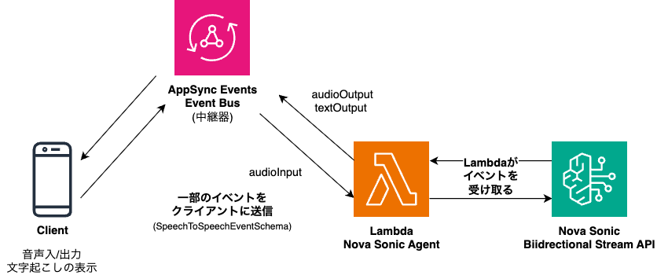

# Nova Sonic Agent Implementation
This is an implementation of an agent that can conduct conversations through Nova Sonic, running on AWS Lambda.

## Nova Sonic Bidirectional Stream API

Nova Sonic enables voice conversations using a stateful bidirectional stream API.

Since the Lambda side handles raw event input/output, the client side only needs to process some events. The client-side processing includes:

* Capture from audio input device and send events
* Receive audio output events and play audio
* Receive transcription events and display text

By having Lambda abstract the stream, the implementation burden on the client side is reduced.

## Resume Processing

As of August 2025, Nova Sonic connections have a [connection time limit of 8 minutes](https://docs.aws.amazon.com/nova/latest/userguide/what-is-nova.html). To continue conversations beyond this time, you need to disconnect the connection and resume the conversation with a new connection. For details, see: [Handling errors with Amazon Nova Sonic - Amazon Nova](https://docs.aws.amazon.com/nova/latest/userguide/speech-errors.html)

This sample implementation also includes resume processing, allowing users to have conversations longer than 8 minutes.
The overview of the resume processing implemented in this sample is as follows:

1. Disconnect the connection after 2-8 minutes have elapsed. The disconnection occurs when Nova Sonic's speech (turn) is completed.
2. Retrieve past conversation history for that session from the database.
3. Create a new connection. When connecting, input the recent conversation history retrieved in step 2.
4. The conversation begins with the new connection.

While the connection is disconnected, user speech audio is accumulated in a queue and input all at once when the connection is re-established. Since users can continue speaking during disconnection and reconnection, resume is achieved without degrading UX.

## Isolation Model
One session runs on one Lambda. This eliminates noisy neighbor problems and resource contention issues, simplifying capacity management and resource management.

Real-time communication with the frontend uses [AppSync Events](https://docs.aws.amazon.com/appsync/latest/eventapi/event-api-welcome.html). This hides the complexity of stateful WebSocket infrastructure, simplifies infrastructure configuration, and reduces operational overhead.
